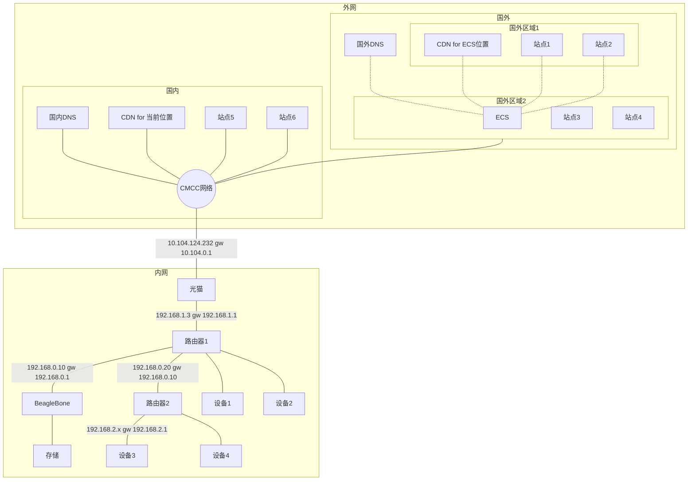


### SMB服务器
BeagleBone上搭建SMB服务器：
参考：<https://ubuntu.com/tutorials/install-and-configure-samba#3-setting-up-samba>
```
# 安装
sudo apt install samba

# 配置
mkdir ~/smb
sudo vim /etc/samba/smb.conf
增加：
[sambashare]
    comment = Samba on BeagleBone
    path = /home/debian/smb
    browsable = yes
    read only = no
    public = yes
```

### 转发到特定网关
1. 开启转发：
```
BeagleBone:
sudo vim /etc/sysctl.conf #net.ipv4.ip_forward=1
sudo echo 1 > /proc/sys/net/ipv4/ip_forward
```
2. 没搞懂为啥在路由器2上设置WAN的网关为BeagleBone，能ping通外网，但tcp/udp不通。路由器上也没法抓包分析，不知道包去哪里了。。（不会是垃圾路由器NAT不规范导致的吧？？想了好久也没想出来为啥）
在BeagleBone上搞个NAT试试吧：
```
BeagleBone:
iptables -tnat -APOSTROUTING -o eth0 -s 192.168.0.20 -j SNAT --to-source 192.168.0.10

重启生效：
sudo iptables-save -f /etc/iptables
sudo vim /etc/network/if-pre-up.d/iptables

#!/bin/sh

/sbin/iptables-restore /etc/iptables
```
如果不搞NAT，回包不用走BeagleBone转发，可以大大减轻BeagleBone的压力的。

### DNS
```
wget https://raw.githubusercontent.com/gfwlist/gfwlist/master/gfwlist.txt
wget https://raw.githubusercontent.com/cokebar/gfwlist2dnsmasq/master/gfwlist2dnsmasq.sh
wget https://github.com/zfl9/dns2tcp.git

./gfwlist2dnsmasq.sh -d 127.0.0.1 -p 15353 -s gfwlist -o gfwlist.rules

ipset create gfwlist hash:ip counters timeout 600

ipset add gfwlist 8.8.8.8 timeout 0

iptables -t nat -N SHADOWSOCKS
iptables -t nat -A SHADOWSOCKS -d 154.91.156.149 -j RETURN
iptables -t nat -A SHADOWSOCKS -p tcp -m set --match-set gfwlist dst -j REDIRECT --to-ports 2357
iptables -t nat -A PREROUTING -p tcp -j SHADOWSOCKS
iptables -t nat -A OUTPUT -p tcp -j SHADOWSOCKS

ip rule add fwmark 0x01/0x01 table 100
ip route add local 0.0.0.0/0 dev lo table 100
iptables -t mangle -N SHADOWSOCKS
iptables -t mangle -A SHADOWSOCKS -d 154.91.156.149 -j RETURN
iptables -t mangle -A SHADOWSOCKS -p udp -m set --match-set gfwlist dst -j TPROXY --on-port 2357 --tproxy-mark 0x01/0x01
iptables -t mangle -A PREROUTING -p udp -j SHADOWSOCKS


./dns2tcp -L"127.0.0.1#15353" -R"127.0.0.1#25353"


sudo iptables -t mangle -N fwmark
sudo iptables -t mangle -A PREROUTING -j fwmark  # 对转发数据包有效
sudo iptables -t mangle -A OUTPUT -j fwmark      # 对从本地发出的数据包有效
sudo iptables -t mangle -A fwmark -m set --match-set bypass_vpn dst -j MARK --set-mark 1  # 给目标地址在 bypass_vpn 中的数据包打上mark 1

sudo iptables -t nat -A POSTROUTING -m mark --mark 0x1 -j MASQUERADE
# 或者使用
sudo iptables -t nat -A POSTROUTING -m mark --mark 0x1 -j SNAT --to-source <your ip>

# rp_filter 改成宽松模式（路由可达即认为数据包合法）
sudo sysctl net.ipv4.conf.{all,enp2s0}.rp_filter=2  # 你的网卡不一定叫 enp2s0


iperf3 -s
iperf3 -c 154.91.156.149


pip3 install genpac

# DNSMASQ格式
genpac --format=dnsmasq --dnsmasq-dns="127.0.0.1#53" --dnsmasq-ipset="ipset-name"


```

### 代理
参考：<https://rdigua.blogspot.com/2019/01/ss-local-gfwlist-ss-local-python.html>
http代理：Privoxy
```
echo 'forward-socks5t / 127.0.0.1:2358 .' >>/etc/privoxy/config

# 关于 gfwlist2privoxy 脚本
# 脚本依赖 base64、curl(支持 https)、perl5 v5.10.0+
# 你也可以从这个网址下载 gfwlist.action，6 小时更新一次
# https://zfl9.github.io/gfwlist2privoxy/gfwlist.action

# 获取 gfwlist2privoxy 脚本
curl -4sSkLO https://raw.github.com/zfl9/gfwlist2privoxy/master/gfwlist2privoxy

# 生成 gfwlist.action 文件
bash gfwlist2privoxy '127.0.0.1:2358'

# 检查 gfwlist.action 文件
more gfwlist.action # 一般有 5000+ 行

# 应用 gfwlist.action 文件
mv -f gfwlist.action /etc/privoxy
echo 'actionsfile gfwlist.action' >>/etc/privoxy/config

# 启动 privoxy.service 服务
systemctl start privoxy.service
systemctl -l status privoxy.service

```

proxychains4

```
# 配置 proxychains-ng
vim /etc/proxychains.conf
# 注释 socks4 127.0.0.1 9050
# 添加 http 127.0.0.1 8118

# 替换当前 shell 进程
# 将 bash 替换为你的 shell
exec proxychains -q bash
```
